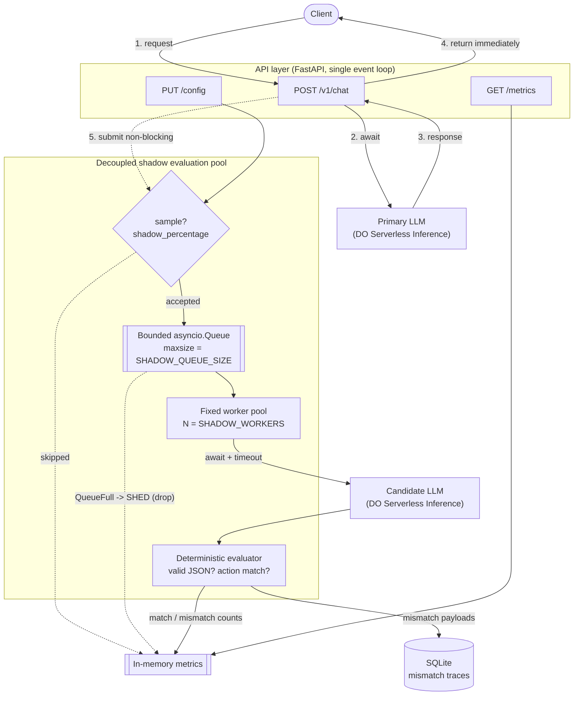

# Architecture

## Flow diagram

## The two paths

**Synchronous path (steps 1–4):** the only work the user waits on is the
Primary call. `POST /v1/chat` awaits the Primary LLM and returns its response
directly. Nothing about the candidate or evaluation is on this path.

**Asynchronous shadow path (step 5 onward):** the request handler calls
`ShadowExecutor.submit()`, which is **non-blocking** — it either enqueues the
job or drops it, then returns instantly. Background worker tasks drain the
queue, call the Candidate LLM (with its own timeout), run the deterministic
evaluation, update metrics, and persist mismatches to SQLite.

Because the two paths only communicate through a bounded queue, the candidate's
latency, errors, or timeouts can never delay or fail the user-facing response.

## Bounding the memory footprint

Two fixed-size structures cap all background memory:

| Bound | Setting | Effect |
|-------|---------|--------|
| Queue length | `SHADOW_QUEUE_SIZE` | Max jobs buffered awaiting a worker |
| Concurrency | `SHADOW_WORKERS` | Max candidate calls in flight at once |

When a burst arrives faster than the workers drain it, the queue fills and
`put_nowait` raises `QueueFull`. Instead of buffering (which would grow memory
without limit), we **shed load**: the evaluation is dropped and the
`shadow.shed` counter increments. Steady-state background memory is therefore
`O(SHADOW_QUEUE_SIZE + SHADOW_WORKERS)` regardless of incoming traffic.
